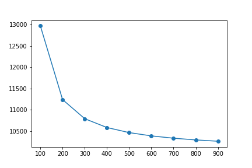

# Documentation

Classes
1. [Loan](#Loan)
2. [Payrange](#Payrange)

# Loan

## Definition
The `Loan` class is used for storing data and making calculations for a single loan.

Assumed we have a loan with the following parameters

    Principal: $10,000
    Annual rate: 5%
    Number of compounding events in compound period: 365 (compounding daily)
    Payment frequency: 1/12 (once a month)
    Payment amount: $200

We can represent this loan using `multiloan`:
```python
from multiloan.loans import Loan
principal = 1e4
rate = .05
n = 365
t = 1/12
payment = 200

# Create `loan` object
loan = Loan(principal, rate, payment, n, t)
loan
```
    Original principal: $10,000.00
    Current balance: $10,000.00
    Payment amount: $200.00
    Total amount paid: $0.00
    Number of payments: 0
    
Note that the default values for `n` and `t` are `365` and `1/12`, respectively, so the same object can be created with:

```python
loan = Loan(principal, rate, payment)
```    

## Functions and properties
Once a `Loan` object is created, payments can be simulated all at once or one at a time.

    Functions
    -------
    pay_remaining(amount): Pay the remaining balance on loan, using `payment` as default or provide a custom `amount`
    pay_one(amount): Make a single payment using `payment` as default or provide a custom `amount`
    reset(): Reset payment history

    Properties
    ----------
    payments: A list of payments made on this loan
    balances: A list of balances after accruing interest and applying payments for each pay period
    totalpay: The total amount paid on this loan (ie. sum(payments))
    n_payments: The number of payments on this loan (ie. len(payments) - 1, to account for initial empty payment)

```python
from multiloan.loans import Loan
principal = 1e4
rate = .05
payment = 1000

# Create loan
loan = Loan(principal, rate, payment)

# Simulate paying off entire loan with monthly payments of $200
loan.pay_remaining()
print(loan)

# We can also extract a list of balances, payments themselves, the total amount paid, and the number of payments
balances = loan.balances
payments = loan.payments
totalpaid = loan.totalpay
n_payments = loan.n_payments

print()
for name, value in zip(['Balances', 'Payments', 'Total', '#Payments'], [balances, payments, totalpaid, n_payments]):
    print(f'{name}: {value}')
```
    Original principal: $10,000.00
    Current balance: $0.00
    Payment amount: $1,000.00
    Total amount paid: $10,236.44
    Number of payments: 11
    
    Balances: [10000.0, 9041.750727376013, 8079.500694338067, 7113.233197420429, 6142.93146341918, 5168.578649101054, 4190.157840911064, 3207.652054678899, 2221.0442353240996, 1230.317256560008, 235.45392059647202, 0.0]
    Payments: [0, 1000, 1000, 1000, 1000, 1000, 1000, 1000, 1000, 1000, 1000, 236.4369578413157]
    Total: 10236.436957841315
    #Payments: 11
    
If you want to reset the payment history on a loan, you can use `loan.reset()`. Additionally, you can make single payments with `loan.pay_one()`

## Notes
- If you're loan balance reached $1,000,000, you will receive an error. This amount can be changed with the `stop` argument or by increasing your `payment`

# Payrange
Payrange allows you to see how varying your routine payments changes the total amount paid for a loan. 

```python
from multiloan.loans import Loan, Payrange
import matplotlib.pyplot as plt
import seaborn as sns

principal = 1e4
rate = .05
payment = 200

# Create loan object
loan = Loan(principal, rate, payment)

# Analyze total costs from monthly payments of $100 to $1,000 a month
paylist = range(100, 1000, 100)
payrange = Payrange(loan, paylist)

# We can now visualize how the total amount paid changes with monthly payment amounts
plt.plot(payrange.payments, payrange.totals)
plt.show()

# Or we can extract a dataframe and plot in seaborn
pay_df = payrange.df
print(pay_df.head())
sns.lineplot('amount', 'total', data=pay_df, marker='o')
plt.show()
```


       amount         total  pct_change  n_payments
    0     100  12971.456824   -0.133494         130
    1     200  11239.839474   -0.039980          57
    2     300  10790.475433   -0.019178          36
    3     400  10583.540737   -0.011280          27
    4     500  10464.161921   -0.007389          21


## Properties

    Properties
    ----------
    amounts: Amount of recurring payments assessed (exluces payment amounts that don't satisfy stop criteria)
    totals: A list of total amount paid at each level of `payrange`
    payments: A list of the number of payments at each level of `payrange`
    pct_change: A list of first difference percent change in `totals`
    df: A Pandas DataFrame of the above data

## Notes
- If an amount in your `payrange` surprasses the stopping criteria then that payment amount will be skipped