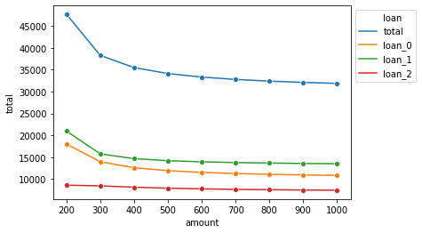

# Documentation

[Classes](#Classes)
1. [Loan](#Loan): Object for a single loan
2. [Multiloan](#Multiloan): Object for handling multiple loans
3. [Payrange](#Payrange): Analyze how the total payment towards a loan changes with varying recurring payment amounts

[How it works](#How-it-works)
1. [Compounding interest](#Compounding-interest)
2. [Multiple loan payments](#Multiple-loan-payments)

# Classes

## Loan

### Parameters
The `Loan` class is used for storing data and making calculations for a single loan.

Assumed we have a loan with the following parameters

    Principal: $10,000
    Annual rate: 5%
    Number of compounding events in compound period: 365 (compounding daily)
    Payment frequency: 1/12 (once a month)
    Reucrring payment amount: $200

We can represent this loan using `multiloan`:
```python
from multiloan.loans import Loan
principal = 1e4
rate = .05
n = 365
t = 1/12
payment = 200

# Create `loan` object
loan = Loan(principal, rate, payment, n, t)
print(loan)
```
    Original principal: $10,000.00
    Current balance: $10,000.00
    Payment amount: $200.00
    Total amount paid: $0.00
    Number of payments: 0
    
Note that the default values for `n` and `t` are `365` and `1/12`, respectively, so the same object can be created with:

```python
loan = Loan(principal, rate, payment)
```    

In summary:

    Parameters
    ----------
    principal: Loan balance
    rate: Interest rate for payment period
    payment: Amount of recurring payment
    n: Number of times interest compounds in pay period
    t: Payment period within rate compounding period
    stop: Stop criteria to avoid infinite calculation (default 1 million)

### Functions and properties
Once a `Loan` object is created, payments can be simulated all at once or one at a time.

    Functions
    -------
    pay_remaining(amount): Pay the remaining balance on loan, using `payment` as default or provide a custom `amount`
    pay_one(amount): Make a single payment using `payment` as default or provide a custom `amount`
    reset(): Reset payment history

    Properties
    ----------
    payments: A list of payments made on this loan
    balances: A list of balances after accruing interest and applying payments for each pay period
    totalpay: The total amount paid on this loan (ie. sum(payments))
    n_payments: The number of payments on this loan (ie. len(payments) - 1, to account for initial empty payment)
    df: A pandas DataFrame of payments and balances

```python
from multiloan.loans import Loan
principal = 1e4
rate = .05
payment = 1000

# Create loan
loan = Loan(principal, rate, payment)

# Simulate paying off entire loan with monthly payments of $200
loan.pay_remaining()
print(loan)

# We can also extract a list of balances, payments themselves, the total amount paid, and the number of payments
balances = loan.balances
payments = loan.payments
totalpaid = loan.totalpay
n_payments = loan.n_payments

print()
for name, value in zip(['Balances', 'Payments', 'Total', '#Payments'], [balances, payments, totalpaid, n_payments]):
    print(f'{name}: {value}')
```
    Original principal: $10,000.00
    Current balance: $0.00
    Payment amount: $1,000.00
    Total amount paid: $10,236.44
    Number of payments: 11
    
    Balances: [10000.0, 9041.750727376013, 8079.500694338067, 7113.233197420429, 6142.93146341918, 5168.578649101054, 4190.157840911064, 3207.652054678899, 2221.0442353240996, 1230.317256560008, 235.45392059647202, 0.0]
    Payments: [0, 1000, 1000, 1000, 1000, 1000, 1000, 1000, 1000, 1000, 1000, 236.4369578413157]
    Total: 10236.436957841315
    #Payments: 11
    
This data can also be viewed in a DataFrame with one row per payment using: `loan.df`


If you want to reset the payment history on a loan, you can use `loan.reset()`. Additionally, you can make single payments with `loan.pay_one()`

### Notes
- If you're loan balance reached $1,000,000, you will receive an error. This amount can be changed with the `stop` argument or by increasing your `payment`

## Multiloan
### Parameters
The `Mutliloan` class is used for storing data and making calculations towards *multiple* loans. Each loan will likely have a different rate, principal, and minimum payment - while you may choose a different `t` for each loan, it may make results hard to interpret.

    Parameters
    ----------
    Loans: an array of Loan objects
    payment: Payment to contribute to all loans per pay period
    filepath: Path to CSV file containing the principal, rate, and payment for each loan, one loan per line.
        By default, it is assumed that the column names are 'principal', 'rate', and 'payment' respectively.
        *Make sure there are NO STRING CHARACTERS in this file (ex. no '$' or ',')
        *Rates must be provided as DECIMALS, not percents (ex. 5% must be provided as .05)
    {principal, rate, payment}_col: Name of column in file at `filepath` indicating each loan feature
    load_kwargs: A dict of keyword arguments to pass to `pd.read_csv()`, which is used to read in `filepath`
    
A multiloan object can be created from either a list of `Loan` objects OR by providing a filepath to a CSV file containing loan data properties like the one [here](data/tutorial_data.csv). If providing a `filepath`, it is most convenient to have your columns named `principal`, `rate`, and `payment` - if this is not the case you can specify the corresponding name of each column by providing it to `{principal, rate, payment}_col`.

For a multiloan, the `payment` is the amount you would like to put towards **all loans** in a given payment period. This amount must exceed the sum of the minimum payments for each loan

```python
from multiloan.loans import Loan, MultiLoan

# Create some loans
loans = [Loan(p, r, pay) for p, r, pay in zip([1000, 13000, 900], [.05, .03, .04], [50, 50, 70])]
# Create a multiloan object from list of loans
ml1 = MultiLoan(loans, payment=500)

### OR ###

# Create multiloan object from CSV
ml2 = MultiLoan(filepath='data/tutorial_data.csv', payment=500)
```

### Functions and properties
The `Multiloan` class shares all of the functions and properties as the `Loan` class, with the ability to examine the balance over all loans and for each loan independently.

    Functions
    -------
    pay_remaining(amount): Pay the remaining balance on loan, using `payment` as default or provide a custom `amount`
    pay_one(amount): Make a single payment using `payment` as default or provide a custom `amount`
    reset(): Reset payment history

    Properties
    ----------
    payments: A list of payments made on this loan
    balances: A list of balances after accruing interest and applying payments for each pay period
    totalpay: The total amount paid on this loan (ie. sum(payments))
    n_payments: The number of payments on this loan (ie. len(payments) - 1, to account for initial empty payment)
    loan_{balances, payments, totals}: A nested list of dimensions [loans X n_payments] containing that loan's {balance,
        payment, total payment} history
    df: A pandas DataFrame of the payment and balance history for each loan, including the "total" payments and
    balances. Each row represents one payment from one loan.

A list of total payments and balances can be accessed with the `payments` and `balances` properties. Matrices of the dimensions [`number of loans` x `number of payments`] can be accessed with `loan_payments` and `loan_balances`. A longform dataframe of all of this data, per loan and in summed, is available with `df`.

The dataframe can be particularly useful for visualization:
```python
import matplotlib.pyplot as plt
import seaborn as sns
from multiloan.loans import MultiLoan

# Create multiloan with $500 monthly payment
"""Generate data"""
# Create multiloan with $500 monthly payment
ml = MultiLoan(filepath='data/tutorial_data.csv', payment=500)

# Pay off all loans
ml.pay_remaining()

"""Visualize"""
# Plot the balance for each loan at each payment period
sns.lineplot('payment', 'balance', 'loan', data=ml.df)
plt.show()
```


## Payrange
Payrange allows you to see how varying your routine payments changes the total amount paid for a loan. 
### Parameters
    Parameters
    ----------
    loan: Either a single Loan or a MultiLoan
    payrange: A list of payment amounts (default = 100 to 1000 by increments of 100)

Here is a single loan example:
```python
from multiloan.loans import Loan, Payrange
import matplotlib.pyplot as plt
import seaborn as sns

principal = 1e4
rate = .05
payment = 200

# Create loan object
loan = Loan(principal, rate, payment)

# Analyze total costs from monthly payments of $100 to $1,000 a month
paylist = range(100, 1000, 100)
payrange = Payrange(loan, paylist)

# We can now visualize how the total amount paid changes with monthly payment amounts
plt.plot(payrange.payments, payrange.totals)
plt.show()

# Or we can extract a dataframe and plot in seaborn
pay_df = payrange.df
print(pay_df.head())
sns.lineplot('amount', 'total', data=pay_df, marker='o')
plt.show()
```


       amount         total  pct_change  n_payments
    0     100  12971.456824   -0.133494         130
    1     200  11239.839474   -0.039980          57
    2     300  10790.475433   -0.019178          36
    3     400  10583.540737   -0.011280          27
    4     500  10464.161921   -0.007389          21


### Properties

    Properties
    ----------
    amounts: Amount of recurring payments assessed (exluces payment amounts that don't satisfy stop criteria)
    totals: A list of total amount paid at each level of `payrange`
    payments: A list of the number of payments at each level of `payrange`
    pct_change: A list of first difference percent change in `totals`
    df: A Pandas DataFrame of the above data

### Notes
- If an amount in your `payrange` surprasses the stopping criteria then that payment amount will be skipped

# How it works

## Compounding interest
This code assumes that each loan **compounds in interest** with the user-specified frequency of `n` within the compounding period. By default `n=365`, anticipating that `rate` you provide is for a year, hence `n=365` since under these conditions the loan will compound 365 times/year. The formula for compound interest is:


For an initial principal *P<sub>i-1</sub>*, interest rate *r*, number of times interest compounds in period *n*, a time elapsed *t*, and the balance following compounding, *P<sub>i</sub>*.
Therefore, a single loan payment is applied by compounding interest over the user-specified time period, `t` (which is 1/12 by default to indicate monthly payments) and then subtracting the payment amount from the new balance.

## Multiple loan payments
The "avalanche method" of multiple loan repayment minimizes the total amount spent by paying off the loans in order of interest rate from high to low. You allot a certain amount you wish to apply to all loans with `Multiloan(..., payment=some_amount)` and for each payment period first the minimum payments are made to each loan and then the remainder is contributed to the reamaining loans with the highest interest rate. 
