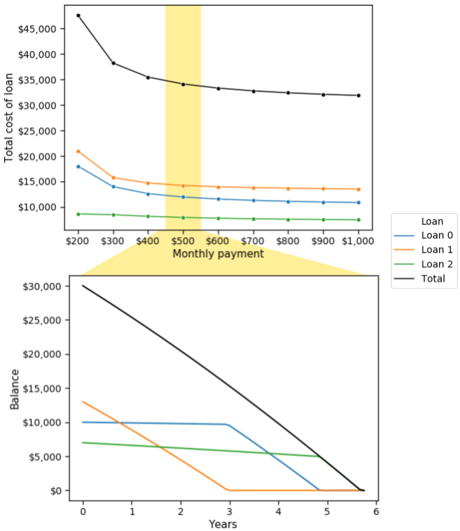

# Multiloan

Quickly analyze the the total cost of paying off one or multiple loans


<p align="center">
  </img>
</p>
# Setup
Installation:
1. Clone this repo: `https://github.com/michaelsilverstein/Loans.git`
2. Install:
    ```bash
    cd Loans
    pip install ./
    ```
**Documentation [here](Documentation.md)**

# References and other tools
1. **https://unbury.us**: This is a great online tool that provided a lot of the inspiration for this project. It shows you the payment trajectory of multiple loans for a single monthly payment amount, as you can do with `multiloan`.

# Contributing
Contributions are most helpful by adding unit tests to the [test](test/) directory

Unit tests can be run with:

    python -m unittest