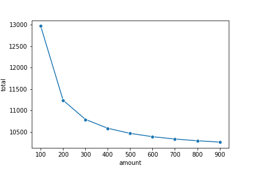

# Multiloan

Quickly analyze the the total cost of paying off one or multiple loans

```python
from multiloan.loans import Loan, Payrange
import matplotlib.pyplot as plt
import seaborn as sns

principal = 1e4
rate = .05
payment = 200

# Create loan object
loan = Loan(principal, rate, payment)

# Analyze total costs from monthly payments of $100 to $1,000 a month
paylist = range(100, 1000, 100)
payrange = Payrange(loan, paylist)

sns.lineplot('amount', 'total', data=payrange.df, marker='o')
plt.show()
```


Documentation [here](Documentation.md)